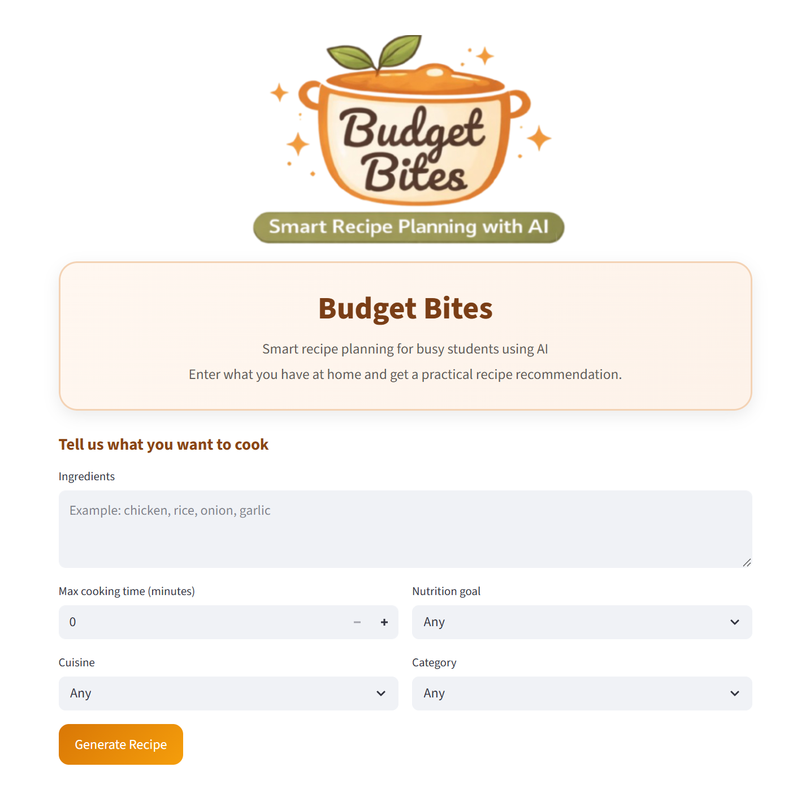

# 🍽️ Budget Bites: Smart Recipe Planner with AI

Budget Bites is an AI-powered recipe recommendation system designed to help users—especially students—create quick, affordable, and healthier meals using available ingredients.

The system combines **Retrieval-Augmented Generation (RAG)** with a **Large Language Model (LLM)** to generate structured, realistic, and context-aware recipes.

---

## 🚀 Features

- Generate recipes based on:
  - Ingredients
  - Cooking time
  - Cuisine
  - Nutrition goals (High Protein, Low Calorie, Low Fat)
  - Category (Breakfast, Lunch, Snack, Dinner, etc.)

- Compare two systems:
  - **Baseline (LLM only)**
  - **Full System (RAG + LLM)**

- Structured recipe output:
  - Recipe name
  - Description
  - Ingredients
  - Steps
  - Total time
  - Calories, Protein, Fats, Carbs

- Interactive UI built with **Streamlit**

---

## 🧠 System Architecture

The system follows a **Retrieval-Augmented Generation pipeline**:

1. User inputs constraints via Streamlit UI  
2. Input is converted into a query  
3. Query is embedded using SentenceTransformers (`all-MiniLM-L6-v2`)  
4. FAISS retrieves similar recipes from the dataset  
5. Recipes are filtered and ranked based on constraints  
6. Retrieved recipes + user input are passed to the LLM  
7. LLM generates the final structured recipe  

---

## ⚙️ Tech Stack

- **LLM**: Google Gemini (gemini-2.5-flash)
- **Embeddings**: SentenceTransformers (`all-MiniLM-L6-v2`)
- **Vector DB**: FAISS
- **Frontend**: Streamlit
- **Dataset**: [Kaggle Recipe Dataset](https://www.kaggle.com/datasets/blossome568/recipe-dataset) 

---

## 📊 Dataset

- Original dataset: ~486 recipes from Kaggle  
- Cleaned dataset: 483 recipes, 20 columns  
- Added fields:
  - Description
  - Ingredients
  - Recipe Steps
  - Nutrition (Calories, Protein, Fats, Carbs)

- Preprocessing includes:
  - Data cleaning and formatting
  - Filling missing values using LLM + references
  - Constraint validation (e.g., cooking time consistency)

---
## 📁 Project Structure

### 📊 Data

| Folder | File | Description |
|--------|------|-------------|
| `data/raw/` | `original_dataset.csv` | Original recipe dataset from Kaggle before any processing |
| `data/cleaned/` | `recipe_dataset_cleaned.csv` | Cleaned and enriched dataset with completed fields (ingredients, steps, nutrition, description) |
| `data/rag/` | `recipe_dataset_with_text.csv` | Dataset converted into unified text format for embedding |
| `data/rag/` | `recipe_faiss.index` | FAISS vector index used for fast semantic retrieval |

---

### 📓 Notebooks & Scripts

| File | Purpose |
|------|--------|
| `01_budget_bites_dataset_cleaning.ipynb` | Data preprocessing, cleaning, and feature engineering (nutrition, steps, ingredients) |
| `02_recipe_retrieval_faiss.ipynb` | Sentence embedding generation and FAISS index construction for semantic search |
| `03_budget_bites_retrieval_llm.ipynb` | Retrieval-Augmented Generation (RAG) pipeline combining FAISS + LLM |
| `04_app.py` | Streamlit web application for user interaction and recipe generation |
| `05_evaluation.py` | Evaluation script comparing baseline LLM vs RAG system performance |
---

## 🧪 Experiments

We evaluated the system under different input scenarios:

| Test Case | Description |
|----------|------------|
| Full Constraints | Ingredients + Time + Cuisine + Category |
| Minimal Input | Ingredients + Category |
| Full Input | All constraints including Nutrition |
| Consistency | Same constraints, repeated runs |
| Health-Focused | Nutrition-focused scenarios |

---

## 📈 Evaluation

We compare:

### 1. Baseline (LLM-only)
- Generates recipes directly from user input  
- No retrieval or grounding  

### 2. Full System (RAG + LLM)
- Retrieves relevant recipes using FAISS  
- Uses retrieved context to guide generation  

### Key Findings

- RAG improves:
  - Constraint satisfaction
  - Recipe coherence
  - Cuisine authenticity
- Baseline struggles with:
  - Nutrition constraints
  - Complex or conflicting inputs
- Both systems struggle with:
  - Conflicting constraints (e.g., sugar + high protein)

---

## 🎥 Demo Videos

### 🔹 RAG System Demonstration
Shows how the full system works end-to-end:
https://www.youtube.com/shorts/oAw4VKbAHMc

### 🔹 Baseline vs RAG Comparison
Demonstrates performance differences across test cases:
https://youtube.com/shorts/EvygYpkIBEU?si=jBmeVP2skfZ7u_Hw

---

## 💡 Key Insights

- RAG significantly improves **context-awareness and reliability**
- Performance improves with **more complete input constraints**
- Weakness remains in:
  - Nutrition enforcement
  - Constraint conflict resolution

---

## ⚠️ Limitations

- Limited dataset size (483 recipes)
- Nutrition values are approximate
- Constraints (time, nutrition) are not always strictly enforced
- Depends on Gemini API (rate limits, variability)

---

## 🔮 Future Work

- Expand dataset (more cuisines, recipes)
- Add dietary filters (vegan, halal, gluten-free)
- Improve constraint reasoning (rule-based validation)
- Add images and visual cooking steps
- Personalization (saved recipes, preferences)

---

## 👥 Team

- Samara Pires  
- Saung Hnin Phyu  
- Anna Tam Ly  
